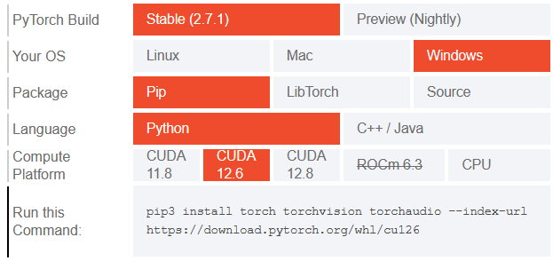

# SMU LLM Project

This project is a **legal simulation analysis framework** that utilizes large language models to evaluate either a legal question or a directory of hypothetical legal scenarios (in the PDF format). Multiple LLM "agents" coordinate to represent different legal perspectives, performs structured analysis, and synthesizes a final legal review.

You can provide either:
- a **direct legal question** using `--question`, or
- a **directory of hypothetical PDFs** using `--hypo`.

The agents will parse and analyze the inputs, and a synthesis panel will consolidate the findings into a final structured markdown report.

# Programme Features

* ✅ Accepts **either** direct legal questions or **multiple hypothetical scenarios** (PDFs)
* ✅ Uses **multiple legal agent models** (internal/external law perspectives) to perform structured analysis
* ✅ Includes a **review synthesis panel** to summarize and unify findings across perspectives
* ✅ Generates **markdown reports** of the analysis for easy review and documentation
* ✅ Modular and extensible via agent configs and environment-based API integration

# Available Parameters

* `--model`: Specify the model backend to use (e.g., `gpt-4`, `gpt-4o`, `gpt-4o-mini`, etc.)
* `--question`: A single legal question string to analyze (mutually exclusive with `--hypo`)
* `--hypo`: Path to a directory of PDFs containing hypothetical legal scenarios

> 💡 Note: You must provide **either** `--question` or `--hypo`, but not both.

# Steps to Run

1. **Install Python 3.12.3**  
   Ensure you have Python 3.12.3 installed. You can verify this with:
   ```bash
   python --version
   ```
   * You may install Python 3.12.3 from this [link](https://www.python.org/downloads/release/python-3123/)
   * Ensure you add Python to your PATH

2. **Create and activate a virtual environment**

   ```bash
   python -m venv myenv
   source myenv/bin/activate        # On macOS/Linux
   myenv\Scripts\activate.bat       # On Windows
   ```

3. **Install dependencies**

   ```bash
   pip install -r requirements.txt
   ```

4. **Download your proper `torch` version**

    Depending on your computer, you will need to install a different version of PyTorch. Please access this [link](https://pytorch.org/get-started/locally/) and fill in your specifications. Copy your command and paste it into your terminal to download the correct version.
    
    * `CUDA 12.6` is recommended
    * `Stable` versions are highly recommended as these have been extensively tested

    

5. **Set up API keys**
   Create a `.env` file in the root directory and populate it with your API keys:

   `OPENAI_API_KEY=your_openai_key`
   `DEEPSEEK_API_KEY=your_deepseek_key`
   `ANTHROPIC_API_KEY=your_anthropic_key`

5. **Run the program**

    Start by entering the `src` folder with `cd ./src` 

   Example of a legal question:

   ```bash
   python main.py --model gpt-4o --question "Can an AI model hold liability under current IP laws?"
   ```

   For a directory of hypothetical PDFs:

   ```bash
   python main.py --model gpt-4o --hypo path/to/pdf_directory
   ```

   After running, results will be saved in a timestamped directory under `results/`.

# Disclaimer

This README was written with the assistance of ChatGPT. 